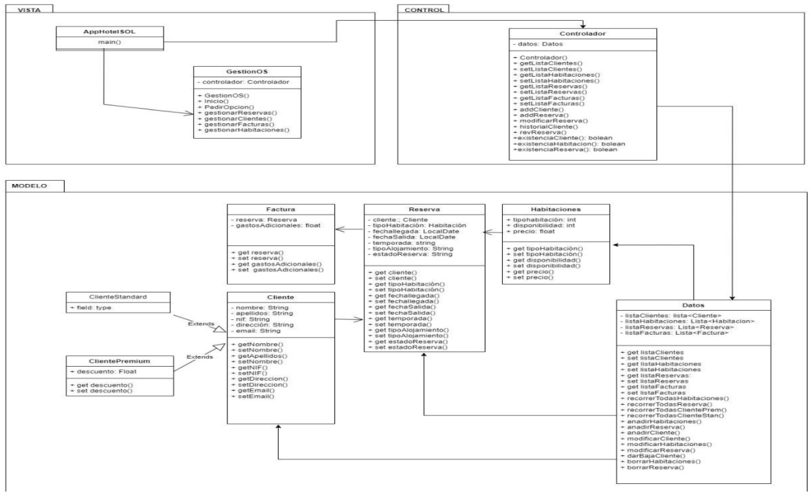
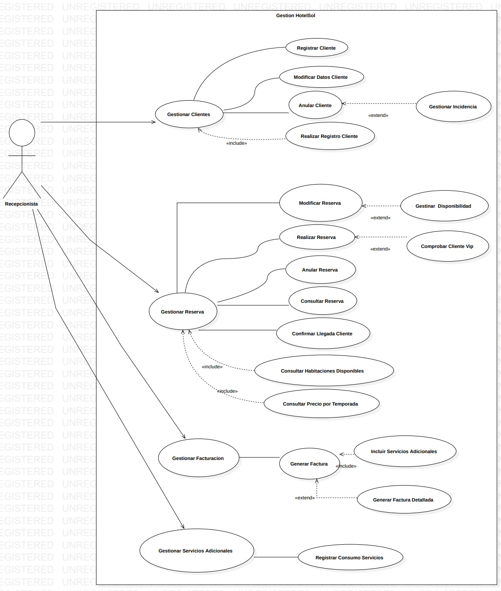
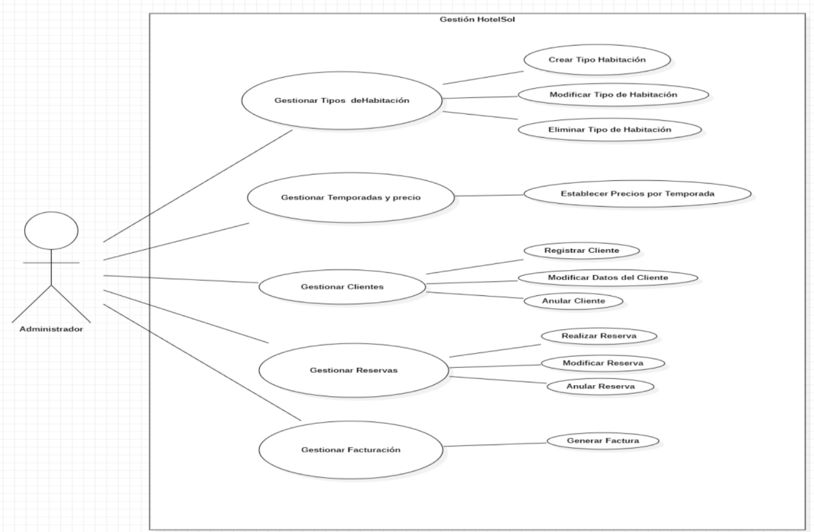
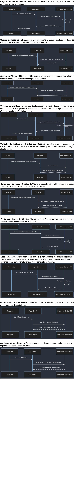

# RocketTeam-HotelSOL_APP
This project involves programming in the .NET environment with access to distributed data, including SQL Server databases and native XML databases. It also includes developing a room reservation management app with an information exchange system using Odoo, requiring JAVA implementation.

Key Features:

* Utilizes Object-Relational Mapping (ORM) with Entity Framework for data access.
* Utilizes ADO (ActiveX Data Objects) for data access when interacting with SQL Server databases.
* Uses ASP.NET utilities for web-based functionalities.
* Built using C# programming language for the core logic.
* Follows the Model-View-Controller (MVC) architectural pattern for organized code structure.
* Includes C# .NET Windows Forms for user interfaces.
* This repository showcases the development and implementation of a comprehensive .NET solution for managing room reservations, accessing distributed data sources, and integrating with the Odoo platform."

## UML DIAGRAM

## USE CASE

## SEQUENCE DIAGRAM

